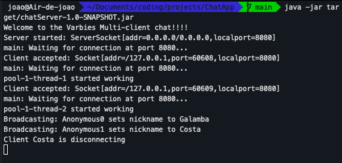
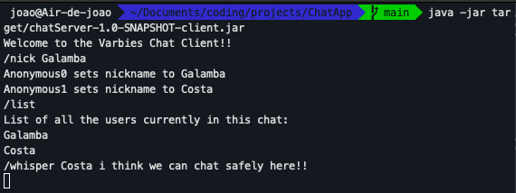
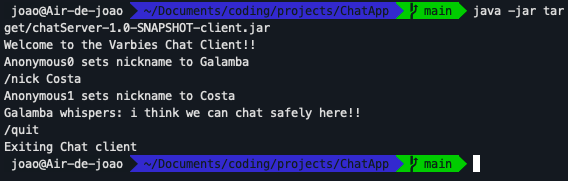

# TCP Chat server and client made in Java
Welcome to ChatApp, a TCP-based chat application developed in Java. This project is designed with multi-client support, featuring a robust cached thread pool that assigns a dedicated thread to each connected client.







## Table of Contents

- [Introduction](#introduction)
- [Features](#features)
- [Installation](#installation)
- [Usage](#usage)
- [Contributing](#contributing)
- [License](#license)

## Introduction

This project was developed using Java and features a cached thread pool to efficiently handle concurrent connections and support a scalable number of clients. The ChatServer manages the communication between clients, while ChatClients connect to the server to exchange messages in real-time.


## Features

- Real-time chat functionality
- Server-client architecture
- Simple and intuitive user interface

## Installation

1. Clone the repository:

    ```bash
    git clone https://github.com/joaosf7/ChatApp.git
    cd ChatApp
    ```

2. Build the project using Maven:

    ```bash
    mvn clean package
    ```

3. Run the ChatServer:

    ```bash
    java -jar target/chatServer-1.0-SNAPSHOT.jar
    ```

4. Run the ChatClient:

    ```bash
    java -jar target/chatServer-1.0-SNAPSHOT-client.jar
    ```

## Usage

1. Start the ChatServer to listen for incoming connections.
2. Launch one or more ChatClients and connect them to the server.
3. Begin chatting with other connected clients in real-time.

Supported commands:

/help - lists the commands available for the client

/list - lists all the users currently in the chat

/nick yourNickname - sets default name to a nickname chosen by the user

/whisper user message - whispers a message to a specific user

/quit - quits the client app

## Contributing

If you'd like to contribute to this project, please do!

## License

This project is licensed under the [MIT License](LICENSE).


#### Supported by VARbies_@codeForAll_